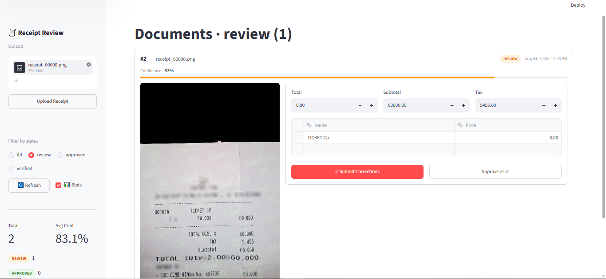

<p align="center">
  
  
  
  
  
  
  
  
</p>

# Document Intelligence Extraction Pipeline

An end-to-end receipt extraction system combining **EasyOCR**, **LayoutLMv3** (token classification), and a **Human-in-the-Loop (HITL)** review interface. Upload a receipt image, get structured JSON back. Low-confidence predictions are routed to a review queue for manual correction.

Runs entirely on **CPU with 8 GB RAM** — no GPU required.

<p align="center">
  
</p>

---

## Table of Contents

- [How It Works](#how-it-works)
- [Architecture](#architecture)
- [Project Structure](#project-structure)
- [Features](#features)
- [Model Details](#model-details)
- [Database Schema](#database-schema)
- [API Reference](#api-reference)
- [Setup & Run](#setup--run)
- [Docker](#docker)
- [Testing](#testing)
- [Configuration](#configuration)
- [Known Limitations](#known-limitations)
- [Troubleshooting](#troubleshooting)
- [License](#license)

---

## How It Works

```
1. UPLOAD          2. OCR                3. CLASSIFY             4. EXTRACT           5. REVIEW
┌─────────┐     ┌──────────┐        ┌──────────────┐        ┌──────────────┐     ┌──────────────┐
│ Receipt │ ──▶ │ EasyOCR  │ ──▶    │  LayoutLMv3  │  ──▶   │  Group by    │ ──▶ │  Streamlit   │
│  Image  │     │ words +  │        │ 31-label     │        │  label,      │     │  HITL UI     │
│         │     │ boxes    │        │ token class. │        │  parse money │     │  correct/    │
└─────────┘     └──────────┘        └──────────────┘        └──────────────┘     │  approve     │
                                                                                  └──────────────┘
```

**Step-by-step pipeline:**

1. **Upload** — Receipt image sent via REST API or Streamlit sidebar
2. **OCR** — EasyOCR (English, CPU) detects words and their 4-corner bounding boxes. Boxes are normalized to 0–1000 scale (matching LayoutLMv3 training format)
3. **Classify** — LayoutLMv3 token classifier assigns one of 31 CORD labels to each word (e.g., `menu.nm`, `menu.price`, `total.total_price`, `O` for ignored)
4. **Extract** — Words sharing the same label are joined. `menu.nm` + `menu.price` pairs become line items. `total.total_price`, `sub_total.subtotal_price`, `sub_total.tax_price` are parsed via `parse_money()` with OCR confusion correction
5. **Review** — If `overall_confidence < CONFIDENCE_THRESHOLD` (default 0.85), the document is flagged `review`. A Streamlit UI lets humans edit fields and submit corrections. High-confidence docs are auto-approved

---

## Architecture

```
┌──────────────────────────────────────────────────────────────────────────┐
│                              USER BROWSER                                │
│                                                                          │
│   http://localhost:8501                    http://localhost:8000/docs     │
│   ┌─────────────────────┐                 ┌─────────────────────┐       │
│   │    Streamlit UI     │                 │    Swagger UI       │       │
│   │   review_app.py     │                 │   (auto-generated)  │       │
│   └────────┬────────────┘                 └──────────┬──────────┘       │
└────────────┼────────────────────────────────────────┼──────────────────┘
             │ HTTP (requests)                       │ HTTP
             ▼                                        ▼
┌─────────────────────────────────────────────────────────────────────────┐
│                          FASTAPI BACKEND                                 │
│                          main.py :8000                                   │
│                                                                          │
│  ┌──────────────────┐  ┌──────────────────┐  ┌──────────────────────┐  │
│  │ POST /upload     │  │ GET /documents   │  │ GET /statistics      │  │
│  │ GET /documents   │  │ GET /documents/  │  │                      │  │
│  │ PUT /verify      │  │ {id}             │  │                      │  │
│  └────────┬─────────┘  └────────┬─────────┘  └──────────┬───────────┘  │
│           │                     │                        │              │
│           ▼                     ▼                        ▼              │
│  ┌──────────────────────────────────────────────────────────────────┐   │
│  │                      BUSINESS LOGIC                              │   │
│  │                                                                  │   │
│  │  model_loader.py          inference.py          database.py      │   │
│  │  ┌────────────────┐  ┌────────────────────┐  ┌──────────────┐   │   │
│  │  │ get_model()     │  │ extract_fields()   │  │ DocumentRec. │   │   │
│  │  │ singleton cache │  │  ├─ EasyOCR        │  │ get_db()     │   │   │
│  │  │ AutoProcessor   │  │  ├─ box normalize  │  │              │   │   │
│  │  │ AutoModel       │  │  ├─ token classify │  │              │   │   │
│  │  │ (8-bit if CUDA) │  │  ├─ word→label map │  │              │   │   │
│  │  └────────────────┘  │  ├─ group by label  │  └──────┬───────┘   │   │
│  │                      │  ├─ parse_money()   │         │           │   │
│  │                      │  └─ confidence calc │         │           │   │
│  │                      └─────────┬──────────┘         │           │   │
│  └────────────────────────────────┼────────────────────┼───────────┘   │
│                                   │                    │                │
└───────────────────────────────────┼────────────────────┼────────────────┘
                                    │                    │
                          ┌─────────▼────────┐  ┌───────▼────────┐
                          │   HuggingFace    │  │    SQLite      │
                          │   Hub            │  │  receipts.db   │
                          │  ~350 MB model   │  │                │
                          └──────────────────┘  └────────────────┘
```

**Data flow:**
- `config.py` → loads `.env`, provides `MODEL_ID`, `CONFIDENCE_THRESHOLD`, `UPLOAD_DIR`
- `model_loader.py` → singleton that downloads and caches the LayoutLMv3 processor + model
- `inference.py` → runs EasyOCR + LayoutLMv3 on an image, returns structured dict
- `database.py` → SQLAlchemy ORM, `DocumentRecord` table, `get_db()` FastAPI dependency
- `schemas.py` → Pydantic models for request/response validation
- `main.py` → FastAPI app: 5 REST endpoints, CORS, static file serving
- `review_app.py` → Streamlit UI: upload, filter, review cards, edit, submit corrections

---

## Project Structure

```
document-intelligence-pipeline/
│
├── config.py              # Loads .env, exposes MODEL_ID, CONFIDENCE_THRESHOLD, UPLOAD_DIR
├── model_loader.py        # Singleton: get_model() → (processor, model), cached
├── inference.py           # extract_fields(processor, model, path) → dict
│                          #   parse_money(s) → float | None
├── database.py            # SQLAlchemy ORM: DocumentRecord, engine, SessionLocal, get_db()
├── schemas.py             # Pydantic: ExtractedData, DocumentResponse, VerificationRequest,
│                          #           StatisticsResponse
├── main.py                # FastAPI app (5 endpoints, CORS, static /uploads)
├── review_app.py          # Streamlit HITL review UI (upload, filter, edit, approve)
│
├── test_local_load.py     # Smoke test: loads model, prints CUDA status, num_labels, id2label
├── test_inference.py      # Smoke test: python test_inference.py <image.jpg>
│
├── requirements.txt       # Pinned Python dependencies
├── Dockerfile             # Containerized FastAPI backend (CPU-only PyTorch)
├── .env.example           # MODEL_ID, CONFIDENCE_THRESHOLD, UPLOAD_DIR
├── .gitignore             # venv/, __pycache__/, receipts.db, uploads/*, training/, .env
│
├── uploads/               # Uploaded receipt images (gitignored, created at runtime)
└── training/              # Training scripts and notebooks (gitignored)
```

---

## Features

| Feature | Detail |
|---|---|
| **CPU-only inference** | Runs on 8 GB RAM with PyTorch CPU. No GPU, no CUDA, no cloud |
| **Two-stage pipeline** | EasyOCR for text detection → LayoutLMv3 for semantic labeling |
| **31-label classification** | Full CORD schema: menu items, prices, totals, tax, subtotal |
| **OCR confusion correction** | `parse_money()` normalizes common OCR errors (O→0, l→1, S→5, B→8) |
| **Confidence-based routing** | `overall_confidence >= threshold` → auto-approved; below → review queue |
| **HITL review UI** | Streamlit app with inline editing, dynamic item table, one-click approve |
| **REST API** | FastAPI with auto-generated Swagger docs at `/docs` |
| **SQLite persistence** | All documents, extractions, and human corrections stored locally |
| **Docker support** | Containerized backend with CPU-only PyTorch (~1.5 GB image) |
| **Singleton model cache** | Model loaded once at startup, shared across all requests |
| **Pagination** | `GET /documents` supports `limit`, `offset`, and `X-Total-Count` header |

---

## Model Details

| Property | Value |
|---|---|
| **Base model** | [`microsoft/layoutlmv3-base`](https://huggingface.co/microsoft/layoutlmv3-base) |
| **Task** | Token classification (word-level labeling) |
| **Fine-tuned on** | [CORD dataset](https://huggingface.co/datasets/naver-clova-ix/cord-v2) (Consolidated Receipt Dataset for OCR) |
| **Number of labels** | 31 |
| **Key labels** | `O`, `menu.nm`, `menu.price`, `menu.unitprice`, `menu.sub_nm`, `menu.sub_price`, `menu.vat_price`, `menu.qty`, `menu.num`, `menu.etc`, `total.total_price`, `total.menuprice`, `total.etc`, `sub_total.subtotal_price`, `sub_total.tax_price`, `sub_total.etc`, `void_menu.nm`, `void_menu.price`, `creditcard.nm`, `creditcard.price`, `emoney.nm`, `emoney.price`, `cashprice`, `discountprice`, `menutype.nm`, `menutype.price`, `payment.nm`, `payment.price`, `store.nm`, `store.price`, `etc` |
| **Max sequence length** | 512 tokens (hard architectural limit of LayoutLMv3-base) |
| **Input format** | Image + OCR words + normalized bounding boxes (0–1000 scale) |
| **OCR at inference** | EasyOCR (English, CPU) — `apply_ocr=False` during training |
| **Training hardware** | Kaggle T4 GPU (free tier, 16 GB VRAM) |
| **HuggingFace Hub** | [`Affankhan007/receipt-extractor-layoutlmv3`](https://huggingface.co/Affankhan007/receipt-extractor-layoutlmv3) |
| **Model size** | ~350 MB (fp32) |
| **Quantization** | 8-bit via `bitsandbytes` if CUDA available (auto-detected) |

---

## Database Schema

**Table: `document_records`** (SQLite, auto-created on first run)

| Column | Type | Constraints | Description |
|---|---|---|---|
| `id` | INTEGER | PRIMARY KEY, AUTOINCREMENT | Unique document ID |
| `filename` | VARCHAR | NOT NULL | Original uploaded filename |
| `upload_path` | VARCHAR | NOT NULL | Path to stored file (UUID-based) |
| `status` | VARCHAR | DEFAULT 'pending' | `pending` → `review` / `approved` → `verified` |
| `extracted_json` | TEXT | | Full extraction result as JSON string |
| `overall_confidence` | FLOAT | | Mean field-level confidence (0.0–1.0) |
| `human_corrections` | TEXT | NULLABLE | Corrected data as JSON string (set on verify) |
| `created_at` | DATETIME | DEFAULT UTCNOW | Upload timestamp |
| `updated_at` | DATETIME | DEFAULT UTCNOW, ONUPDATE | Last modification timestamp |

**Status lifecycle:**
```
pending ──(upload)──▶ review ──(verify)──▶ verified
                   ▶ approved ──(verify)──▶ verified
```

---

## API Reference

Base URL: `http://localhost:8000`

### `POST /documents/upload`

Upload a receipt image. Runs OCR + LayoutLMv3 extraction. Auto-approves if confidence >= threshold.

**Request:** `multipart/form-data`
| Field | Type | Required | Description |
|---|---|---|---|
| `file` | file | Yes | Receipt image (PNG, JPG, JPEG, TIFF, BMP) |

**Response:** `200 OK` — `DocumentResponse`
```json
{
  "id": 1,
  "filename": "receipt.jpg",
  "upload_path": "./uploads/a1b2c3d4-....png",
  "status": "review",
  "extracted_data": {
    "items": [
      {"name": "Americano", "price": 4.50},
      {"name": "Latte", "price": 5.00}
    ],
    "subtotal": 9.50,
    "tax": 0.95,
    "total": 10.45,
    "overall_confidence": 0.78,
    "raw": {
      "menu.nm": "Americano Latte",
      "menu.price": "4.50 5.00",
      "total.total_price": "10.45",
      "sub_total.subtotal_price": "9.50",
      "sub_total.tax_price": "0.95"
    }
  },
  "overall_confidence": 0.78,
  "human_corrections": null,
  "created_at": "2026-08-04T14:30:00",
  "updated_at": "2026-08-04T14:30:00"
}
```

### `GET /documents`

List documents with optional status filter and pagination.

**Query Parameters:**
| Param | Type | Default | Description |
|---|---|---|---|
| `status` | string | — | Filter: `review`, `approved`, `verified`, `pending` |
| `limit` | int | 100 | Max results (1–1000) |
| `offset` | int | 0 | Pagination offset |

**Response:** `200 OK` — `list[DocumentResponse]`
**Headers:** `X-Total-Count: 42`

### `GET /documents/{id}`

Get a single document by ID.

**Response:** `200 OK` — `DocumentResponse`
**Errors:** `404` — Document not found

### `PUT /documents/{id}/verify`

Submit human corrections. Sets status to `verified`.

**Request:** `application/json`
```json
{
  "corrected_data": {
    "total": 10.45,
    "subtotal": 9.50,
    "tax": 0.95,
    "items": [
      {"name": "Americano", "price": 4.50}
    ]
  }
}
```

**Response:** `200 OK` — `DocumentResponse` (with `status: "verified"`)
**Errors:** `404` — Document not found

### `GET /statistics`

Aggregate statistics across all documents.

**Response:** `200 OK`
```json
{
  "total_documents": 42,
  "by_status": {
    "review": 12,
    "approved": 20,
    "verified": 8,
    "pending": 2
  },
  "average_confidence": 0.83
}
```

### `GET /uploads/{filename}`

Serve uploaded receipt images. Mounted from `UPLOAD_DIR`.

---

## Setup & Run

### Prerequisites

- **Python 3.10+**
- **8 GB RAM** (model ~350 MB + EasyOCR ~100 MB + overhead)
- **Windows**, **Linux**, or **macOS**
- **2 GB free disk space** (model weights + dependencies)

### 1. Clone

```bash
git clone https://github.com/Affankhan007/document-intelligence-pipeline.git
cd document-intelligence-pipeline
```

### 2. Virtual Environment

```bash
python -m venv venv

# Windows
venv\Scripts\activate

# Linux / macOS
source venv/bin/activate
```

### 3. Install Dependencies

```bash
pip install -r requirements.txt
```

First install downloads ~2 GB of packages (PyTorch, Transformers, EasyOCR). Subsequent installs are cached.

### 4. Configure

```bash
cp .env.example .env
```

Default values work out of the box. Edit `.env` to customize:

```env
MODEL_ID=Affankhan007/receipt-extractor-layoutlmv3
CONFIDENCE_THRESHOLD=0.85
UPLOAD_DIR=./uploads
```

### 5. Start Backend

```bash
uvicorn main:app --reload
```

First run downloads the model (~350 MB) and EasyOCR weights (~100 MB) from HuggingFace Hub. This takes 2–5 minutes depending on internet speed. Subsequent starts are instant (model cached).

**Verify:** Open http://localhost:8000/docs — Swagger UI should load.

### 6. Start Review UI (separate terminal)

```bash
# Activate venv first, then:
streamlit run review_app.py
```

Open http://localhost:8501

### 7. Upload a Receipt

- **Via Streamlit:** Use the sidebar upload widget → click "Upload Receipt"
- **Via Swagger:** http://localhost:8000/docs → `POST /documents/upload` → Try it out
- **Via curl:**
  ```bash
  curl -X POST http://localhost:8000/documents/upload -F "file=@receipt.jpg"
  ```

### 8. Review & Correct

Documents with confidence < 0.85 appear in the "review" queue. Edit fields inline, then click **Submit Corrections** or **Approve as-is**.

---

## Docker

Containerized FastAPI backend only (Streamlit runs on the host).

```bash
# Build (~5-10 minutes, downloads PyTorch CPU + model)
docker build -t receipt-extractor .

# Run
docker run -p 8000:8000 receipt-extractor
```

The image uses `--index-url https://download.pytorch.org/whl/cpu` to install CPU-only PyTorch, keeping the image under ~2 GB.

**Note:** The model is downloaded at container startup (first run), not at build time. Mount a volume to persist it:

```bash
docker run -p 8000:8000 -v hf_cache:/root/.cache/huggingface receipt-extractor
```

---

## Testing

### Model Load Test

```bash
python test_local_load.py
```

**Expected output:**
```
CUDA available: False
Load time: 12.34s
Num labels: 31
  id2label[0] = O
  id2label[1] = menu.nm
  id2label[2] = menu.price
  id2label[3] = menu.unitprice
  id2label[4] = menu.sub_nm
```

### Inference Test

```bash
python test_inference.py path/to/receipt.jpg
```

**Expected output:** JSON with `items`, `subtotal`, `tax`, `total`, `overall_confidence`, `raw`.

### API Smoke Test

```bash
# Check backend is alive
curl http://localhost:8000/statistics

# Upload a receipt
curl -X POST http://localhost:8000/documents/upload -F "file=@receipt.jpg"

# List review documents
curl "http://localhost:8000/documents?status=review"

# Verify a document
curl -X PUT http://localhost:8000/documents/1/verify \
  -H "Content-Type: application/json" \
  -d '{"corrected_data": {"total": 42.50}}'
```

---

## Configuration

All configuration via `.env` file (or environment variables):

| Variable | Default | Description |
|---|---|---|
| `MODEL_ID` | `Affankhan007/receipt-extractor-layoutlmv3` | HuggingFace model repository |
| `CONFIDENCE_THRESHOLD` | `0.85` | Auto-approve when `overall_confidence >=` this value |
| `UPLOAD_DIR` | `./uploads` | Directory for uploaded receipt images (auto-created) |

**Tuning `CONFIDENCE_THRESHOLD`:**
- **0.95** — Very strict. Almost everything goes to review. Fewer false approvals, more human work
- **0.85** (default) — Balanced. High-confidence receipts auto-approved
- **0.70** — Lenient. More auto-approvals, higher risk of incorrect extractions slipping through

---

## Known Limitations

### 1. 512-Token Architectural Limit

LayoutLMv3-base has a hard maximum of 512 position embeddings. The processor is configured with `truncation=True, padding="max_length", max_length=512`. This means:

- **Dense receipts** (long restaurant bills, grocery lists with 30+ items) will have words beyond the 512-token boundary **silently dropped**
- Dropped words receive no label — they are effectively invisible to the model
- This is a **hard architectural constraint** of `microsoft/layoutlmv3-base` and cannot be increased

**Mitigation:** For production use with long receipts, consider splitting the image into sections, or migrating to a model with longer context (LayoutLMv3 does not support >512; alternatives like LiLT or Donut may be worth evaluating)

### 2. Out-of-Distribution Shift

The model was fine-tuned on the **Korean CORD dataset** (Korean cafe and restaurant receipts). When applied to receipts from other domains:

- **US cafe/grocery receipts** — store headers, non-standard labels, and decorative text may be misclassified as `menu.nm` (item names) or `O` (ignored)
- **Non-receipt documents** — invoices, bills of lading, handwritten notes, screenshots will produce unpredictable results
- **Different currencies** — the model has no currency awareness; `parse_money()` extracts numeric values regardless of currency symbol

**Mitigation:** The HITL review queue is designed specifically for this — low-confidence predictions are flagged for human correction. Over time, corrected data can be used to fine-tune the model on your specific receipt domain

### 3. EasyOCR Symbol Confusion

EasyOCR can misread certain characters depending on font, background, and image quality:

| Actual | Misread as | Handled by `parse_money()`? |
|---|---|---|
| `$` (dollar) | `5`, `8` | No |
| `O`, `o`, `Q` | `0` | Yes |
| `l`, `I` | `1` | Yes |
| `S` | `5` | Yes |
| `B` | `8` | Yes |
| `.` (decimal) | `,` (comma) | Partially (comma stripped) |
| `7` | `1` | No |

The `parse_money()` function applies character-level corrections for the most common confusions, but edge cases (especially `$` → `5`) may still produce incorrect prices. Always verify extracted totals against the receipt image.

### 4. Single-Image, Synchronous Processing

- Each upload processes one image synchronously. Concurrent uploads queue up in FastAPI's thread pool
- On 8 GB RAM with CPU-only inference, each extraction takes 5–15 seconds depending on image size and word count
- No batch processing, no async inference pipeline

### 5. No Authentication

The API has no authentication or authorization. CORS is wide open (`allow_origins=["*"]`). This is intentional for local development. Add auth (API keys, OAuth) before exposing to a network.

---

## Troubleshooting

| Problem | Likely Cause | Solution |
|---|---|---|
| `Backend not running` in Streamlit | uvicorn not started | Run `uvicorn main:app --reload` in another terminal |
| `CUDA out of memory` | GPU has insufficient VRAM | Set `CUDA_VISIBLE_DEVICES=""` to force CPU, or reduce batch size |
| Model download hangs | Slow internet / HF Hub rate limit | Wait; first download is ~350 MB. Use `HF_HUB_ENABLE_HF_TRANSFER=1` for faster downloads |
| `ModuleNotFoundError: No module named 'easyocr'` | Missing dependency | Run `pip install -r requirements.txt` |
| `AttributeError: 'Session' object has no attribute 'func'` | Old code | Pull latest — this was fixed (replaced `db.func` with `func` from sqlalchemy) |
| Streamlit shows old data after DB reset | Cached in browser | Click **🔄 Refresh** in sidebar, or press `R` in browser |
| Image not displaying in Streamlit | Backend not serving static files | Ensure uvicorn is running and `UPLOAD_DIR` exists |
| `receipts.db` is locked | Another process using it | Stop all uvicorn/streamlit processes, delete `receipts.db`, restart |

---

## License

MIT — see [LICENSE](LICENSE) file.

---

<p align="center">
  <sub>Built with ❤️ using PyTorch, HuggingFace Transformers, FastAPI, and Streamlit</sub>
</p>
